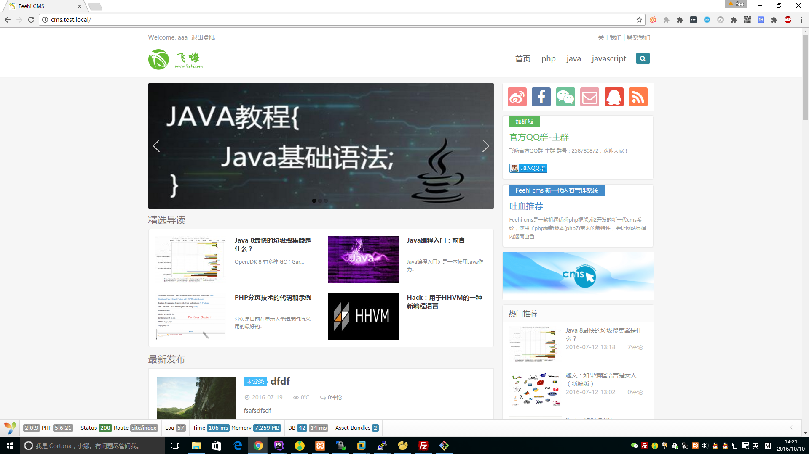

FeehiCMS __[(English)](docs/README_EN.md)__
===============================

基于yii2的CMS系统，运行环境与yii2(php>=5.4)一致。FeehiCMS旨在为yii2爱好者提供一个基础功能完善的CMS系统，使开发者更专注于业务功能开发。
FeehiCMS没有对yii2做任何的修改、封装，但是把yii2的一些优秀特性几乎都用在了FeehiCMS上，对于学习yii2框架提供了良好的实例。


更新记录
---------------
0.1.3版本已经集成swoole作为FeehiCMS应用服务器，详细配置及使用参见[yii2-swoole](https://www.github.com/liufee/yii2-swoole)

帮助
---------------
开发文档 [http://doc.feehi.com](http://doc.feehi.com)

QQ群 258780872

[bug反馈](http://www.github.com/liufee/cms/issues)


功能
---------------
 * 网站设置
 * 前后台菜单
 * 文章管理 
 * 权限管理
 * 多语言
 * 记录管理员操作日志
 * 缓存管理
 * 前后台用户
 
 
快速体验
----------------
1. 使用演示站点
演示站点后台   **用户名:feehicms 密码123456**
      * php7.0.0
        * 后台 [http://demo.cms.feehi.com/admin](http://demo.cms.feehi.com/admin)
        * 前台 [http://demo.cms.feehi.com](http://demo.cms.feehi.com/)
      * swoole (docker)
        * swoole演示前台[http://swoole.demo.cms.qq.feehi.com](http://swoole.demo.cms.qq.feehi.com)
        * swoole演示后台[http://swoole-admin.demo.cms.qq.feehi.com](http://swoole-admin.demo.cms.qq.feehi.com)
      * php7.1.8 (docker)
        * 备用演示前台1[http://demo.cms.qq.feehi.com/admin](http://demo.cms.qq.feehi.com/admin)
        * 备用演示后台1[http://demo.cms.qq.feehi.com/admin](http://demo.cms.qq.feehi.com/admin)
      * php5.4 (docker)
        * 备用演示前台2[http://php54.demo.cms.qq.feehi.com](http://php54.demo.cms.qq.feehi.com/)
        * 备用演示后台2[http://php54.demo.cms.qq.feehi.com/admin](http://php54.demo.cms.qq.feehi.com/admin)
      
2. 使用Docker容器
    ```bash
    $ docker pull registry.cn-hangzhou.aliyuncs.com/liufee/cms
    $ docker run --name feehicms -h feehicms -itd -p 80:80 -p 22:22 liufee/cms
    ```
 
 
安装
---------------
前置条件: 如未特别说明，已默认您把php命令加入了环境变量
1. 使用归档文件
    >使用此方式安装，后台超管用户名和密码会在安装过程中让您填入
    1. 下载FeehiCMS源码 [点击此处下载最新版](http://7xjkuy.com1.z0.glb.clouddn.com/Feehi_CMS.zip)
    2. 解压到目录 
    3. 配置web服务器(参见下面)
    4. 浏览器打开 http://localhost/install.php 按照提示完成安装(若使用php内置web服务器则地址为 http://localhost:8080/install.php )
    5. 完成
    
2. 使用composer (推荐使用此方式安装)
    >使用此方式安装，默认的后台超级管理员用户名admin密码123456
     composer的安装以及国内镜像设置请点击[此处](http://www.phpcomposer.com/)
     1. 依次执行以下命令
         ```bash
         $ composer create-project feehi/cms webApp
         $ cd webApp
         $ composer install -vvv
         $ php ./init --env=Production #初始化yii2框架
         $ php ./yii migrate/up --interactive=0 #导入FeehiCMS sql数据库，执行此步骤之前请先到common/config/main-local.php修改成正确的数据库配置
         ```
     2. 配置web服务器(参加下面)
     3. 完成
 
附:web服务器配置(注意是设置"path/to/frontend/web为根目录)
 
 * php内置web服务器(仅可用于开发环境,当您的环境中没有web服务器时)
 ```bash
  cd /path/to/cms
  php ./yii serve  
  
  #至此启动成功，可以通过localhost:8080/和localhost:8080/admin来访问了，在线安装即访问localhost:8080/install.php
 ```
 
 * Apache
 ```bash
  DocumentRoot "path/to/frontend/web"
  <Directory "path/to/frontend/web">
      # 开启 mod_rewrite 用于美化 URL 功能的支持（译注：对应 pretty URL 选项）
      RewriteEngine on
      # 如果请求的是真实存在的文件或目录，直接访问
      RewriteCond %{REQUEST_FILENAME} !-f
      RewriteCond %{REQUEST_FILENAME} !-d
      # 如果请求的不是真实文件或目录，分发请求至 index.php
      RewriteRule . index.php
  
      # ...其它设置...
  </Directory>
  ```
  
 * Nginx
 ```bash
 server {
     server_name  localhost;
     root   /path/to/frontend/web;
     index  index.php index.html index.htm;
     try_files $uri $uri/ /index.php?$args;
 
     location ~ \.php$ {
         fastcgi_pass   127.0.0.1:9000;
         fastcgi_index  index.php;
         fastcgi_param  SCRIPT_FILENAME  $document_root$fastcgi_script_name;
         include        fastcgi_params;
         try_files $uri=404;
     }
 }
 ```
 

运行效果
---------



